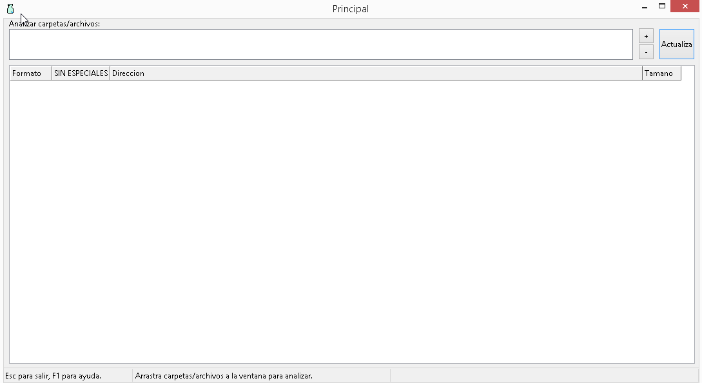

### checkfiles
----
win32 app for checking:

- linux EOF
- special characters(non-ascii)

features:
- Drag and drop files/directories capable
- select files or directories to add / analize
- double click over item to open file
- remove files/directories in target area
- updateable results

:two_hearts: